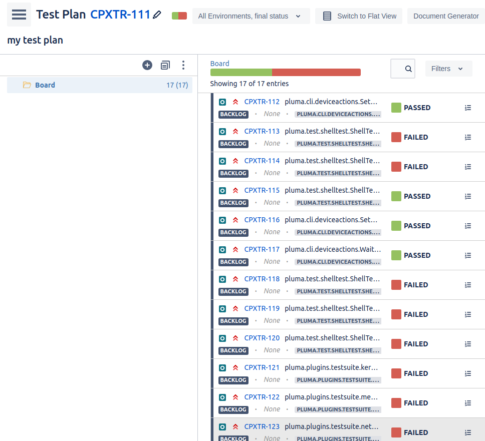

# Tutorial: XRay Cloud Integration Setup

Pluma can publish test results to an [XRay Cloud](https://docs.getxray.app/display/XRAYCLOUD/About+Xray) to allow further exploration of the results. XRay server is not currently supported.



To use this integration, you will need your JIRA domain, JIRA project key, a [JIRA API token](https://id.atlassian.com/manage-profile/security/api-tokens#), and a [XRay API key](https://docs.getxray.app/display/XRAYCLOUD/Global+Settings%3A+API+Keys) (you may need to ask your system administrator to generate one). Once you have this information, XRay reporting can be activated by adding the following to the `settings` of your test configutation (`pluma.yml`):
```yaml
settings:
    reporters:
        xray:
            jira_project_key: EXKEY
            jira_url: https://your-company.atlassian.net
            jira_username: example@your-company.com
            jira_password: ''
            xray_client_id: ''
            xray_client_secret: ''
            test_plan_name: my plan long name
```
Moving the sensitive configuration values to environment varibles is optional but recommended:
```yaml
settings:
    reporters:
        xray:
            jira_project_key: EXKEY
            jira_url: https://your-company.atlassian.net
            jira_username: example@your-company.com
            jira_password: ${PLUMA_JIRA_PASSWORD}
            xray_client_id: ''
            xray_client_secret: ${PLUMA_XRAY_CLIENT_SECRET}
            test_plan_name: my plan long name
```
```sh
export PLUMA_JIRA_PASSWORD=password
export PLUMA_XRAY_CLIENT_SECRET=secret
pluma
```

When pluma is initially run with this integration it will automatically generate a test plan issue and the associated tests issues for the current test configuration on startup. This process can take up to five minutes. After these issues have been generated, Pluma will report test results in a test execution issue once the tests have completed. Subsequent Pluma invokations will attempt to reuse the previous test plan and tests (if available), but will always create a new test execution.
